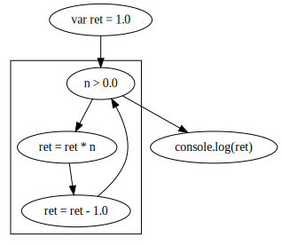
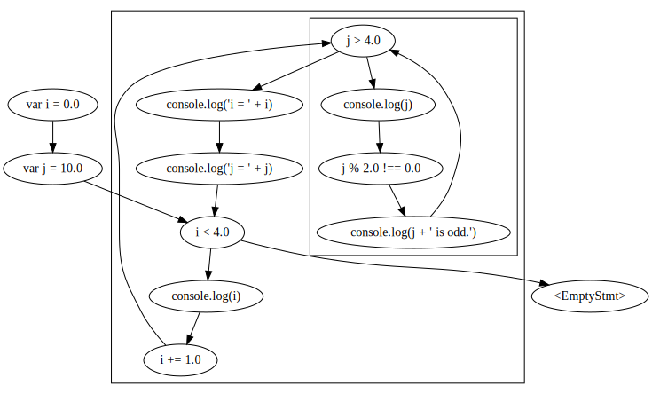

# cs738 HW#2

## Requirements 

- JDK version: Java 8
- Scala: 2.11.*
- SBT: 1.4.7


## TestCase #1
```javascript
var ret = 1;

while (n > 0) {
  ret = ret * n;
  ret = ret - 1;
}
```

```
digraph cs738_Script {
  "var ret = 1.0" -> "n > 0.0"
  subgraph cluster_3 {
    "ret = ret * n" -> "ret = ret - 1.0"
    "ret = ret - 1.0" -> "n > 0.0"
  }
  "n > 0.0" -> "console.log(ret)"
  "n > 0.0" -> "ret = ret * n"
}
```





## TestCase #2
```javascript
var i = 0;
var j = 10; 
while (i < 4) {
	console.log(i);
	i += 1;

	while (j > 4) {
		console.log(j); 
		if ((j % 2) !== 0) { 
			console.log(j + ' is odd.');
		}
	}
	console.log('i = ' + i);
	console.log('j = ' + j);
};
```


```
digraph cs738_Script {
  "var i = 0.0" -> "var j = 10.0"
  "var j = 10.0" -> "i < 4.0"
  subgraph cluster_4 {
    "console.log(i)" -> "i += 1.0"
    "i += 1.0" -> "j > 4.0"
    subgraph cluster_8 {
      "console.log(j)" -> "j % 2.0 !== 0.0"
      "console.log(j + ' is odd.')" -> "j > 4.0"
      "j % 2.0 !== 0.0" -> "console.log(j + ' is odd.')"
    }
    "j > 4.0" -> "console.log('i = ' + i)"
    "j > 4.0" -> "console.log(j)"
    "console.log('i = ' + i)" -> "console.log('j = ' + j)"
    "console.log('j = ' + j)" -> "i < 4.0"
  }
  "i < 4.0" -> "<EmptyStmt>"
  "i < 4.0" -> "console.log(i)"
}
```





