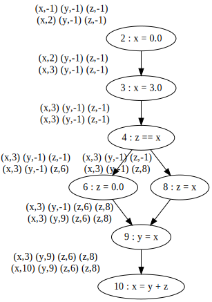

# cs738 HW#3
Reaching Definiton Analysis using Worklist

## Requirements 

- JDK version: Java 8 (scala 2.11.* needs JDK 8 to compile itself)
- Scala: 2.11.*
- SBT: 1.4.7


## Running the project

```
sbt compile
sbt run
```

## Example #1

```javascript

```
x = 5;
y = 1;

while (x > 1) {
	y = x * y;
	x = x -1;
}
```
2    (x,-1) (y,-1)                            (x,2) (y,-1)
3    (x,2) (y,-1)                             (x,2) (y,3)
4    (x,2) (x,7) (y,3) (y,6)                  (x,2) (x,7) (y,3) (y,6)
6    (x,2) (x,7) (y,3) (y,6)                  (x,2) (x,7) (y,6)
7    (x,2) (x,7) (y,6)                        (x,7) (y,6)
```




## Example #2


```javascript

```
x = 0;
x = 3;

if (z == x) {
	z = 0
}
else {
	z = x;
}

y = x;
x = y +z;
```
2    (x,-1) (y,-1) (z,-1)                     (x,2) (y,-1) (z,-1)
3    (x,2) (y,-1) (z,-1)                      (x,3) (y,-1) (z,-1)
4    (x,3) (y,-1) (z,-1)                      (x,3) (y,-1) (z,-1)
6    (x,3) (y,-1) (z,-1)                      (x,3) (y,-1) (z,6)
8    (x,3) (y,-1) (z,-1)                      (x,3) (y,-1) (z,8)
9    (x,3) (y,-1) (z,6) (z,8)                 (x,3) (y,9) (z,6) (z,8)
10   (x,3) (y,9) (z,6) (z,8)                  (x,10) (y,9) (z,6) (z,8)
```


