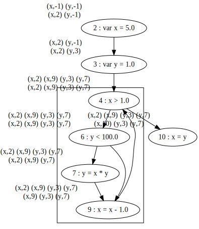

# cs738 HW#4
Reaching Definition and Live variable Analysis using Bit Vector framework.

## Requirements

- JDK version: Java 8 (scala 2.11.* needs JDK 8 to compile itself)
- Scala: 2.11.*
- SBT: 1.4.7


## Running the project

```
sbt compile
sbt run
```

### Live variable analysis

Test file: `lv.js`

```javascript
var x = 2;
var y = 4; 
var x = 1;

if (y>x) 
	z = y; 
else 
	z = y*y; 

x = z;
```

```
2    {}                                       {}
3    {}                                       {y}
4    {y}                                      {x, y}
5    {x, y}                                   {y}
6    {y}                                      {z}
7    {y}                                      {z}
8    {z}                                      {}
```


### Reaching Definition Analysis

Test file: `rd1.js`

```javascript
var x = 5;
var y = 1;

while (x > 1) {
	if(y < 100)  
		y = x * y; 
	x = x -1; 
}

x = y;
```

```
2    (x,-1) (y,-1)                            (x,2) (y,-1)
3    (x,2) (y,-1)                             (x,2) (y,3)
4    (x,2) (x,9) (y,3) (y,7)                  (x,2) (x,9) (y,3) (y,7)
6    (x,2) (x,9) (y,3) (y,7)                  (x,2) (x,9) (y,3) (y,7)
7    (x,2) (x,9) (y,3) (y,7)                  (x,2) (x,9) (y,7)
9    (x,2) (x,9) (y,3) (y,7)                  (x,9) (y,3) (y,7)
10   (x,2) (x,9) (y,3) (y,7)                  (x,10) (y,3) (y,7)
```



Test file: `rd.js`

```javascript
var x = 0;
x = 3;

if (z == x) {
	z = 0
}
else {
	z = x;
}

y = x;
x = y +z;
```

```
2    (x,-1) (y,-1) (z,-1)                     (x,2) (y,-1) (z,-1)
3    (x,2) (y,-1) (z,-1)                      (x,3) (y,-1) (z,-1)
4    (x,3) (y,-1) (z,-1)                      (x,3) (y,-1) (z,-1)
6    (x,3) (y,-1) (z,-1)                      (x,3) (y,-1) (z,6)
8    (x,3) (y,-1) (z,-1)                      (x,3) (y,-1) (z,8)
9    (x,3) (y,-1) (z,6) (z,8)                 (x,3) (y,9) (z,6) (z,8)
10   (x,3) (y,9) (z,6) (z,8)                  (x,10) (y,9) (z,6) (z,8)
```

