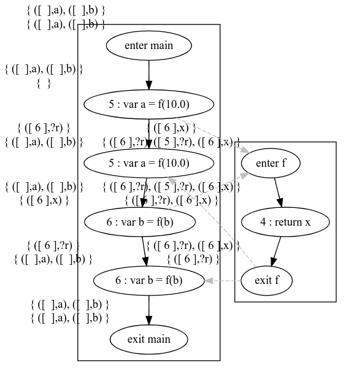
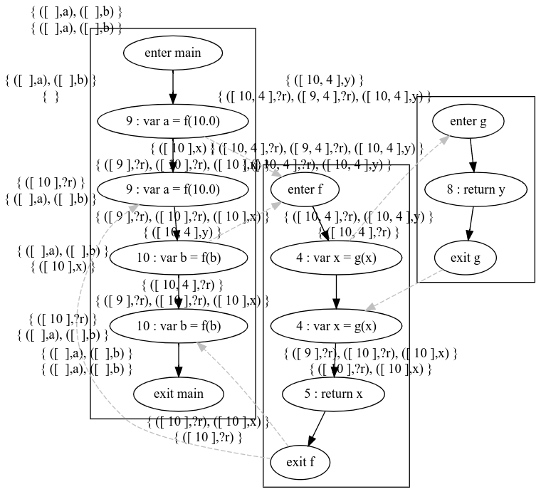

# cs738 HW#5
Context sensitive data flow analysis with call strings

## Requirements 

- JDK version: Java 8 (scala 2.11.* needs JDK 8 to compile itself)
- Scala: 2.11.*
- SBT: 1.4.7


## Running the project

```
sbt compile
sbt run
```

## Example #1

```javascript
function f(x) {
	return x;
}

var a = f(10);

var b = f(b);
```



## Example #2

```javascript
function f(x) {
	var x = g(x);
	return x;
}

function g(y) { 
	return y;
}

var a = f(10);

var b = f(b);
```
