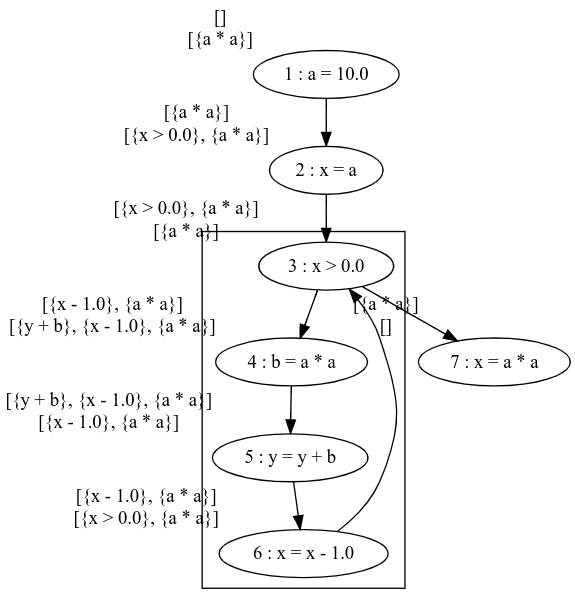
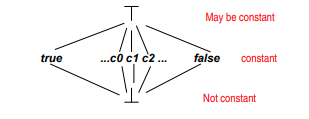
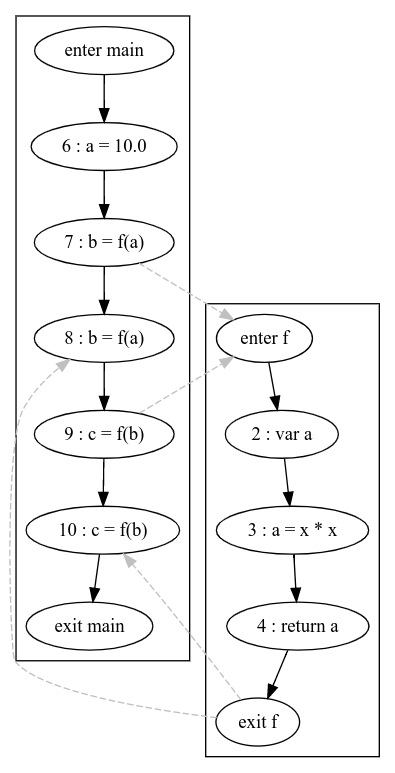

# Midterm - Program Analysis

Seyedamirhossein Hesamian
March 18th, 2021

-----

1.1)
Forward analysis: $$E = { init(S_*) } = \{ 1 \}$$
Backward analysis: $$E = { final(S_*) } = \{ 7 \}$$

1.2)

Very busy expressions $$\iota = \emptyset $$

Reaching definitions $$\iota = \{ (x, \text{?}) | x \in FV(S_*) \} = \{ (a, \text{?}), (b, \text{?}), (x, \text{?}), (y, \text{?}) \} $$

Or in Scala:

```scala
val tuples: [(String, Long)] = Utils.vars(stmt).map((_, ?))
```

1.3)
Very busy expressions

$$ \bot = AExp = \{ \text{x > 0}, \text{a * a}, \text{y + b}, \text{x - 1} \}$$

Or in Scala:

```scala
val exprs: Ser[Expression] = Utils.aexpr(strmt)
```

Reaching definitions

$$ \bot = \emptyset $$

1.4)
Very busy expression is a **must** analysis and **backward**. So we need to use a backward CFG and **intersection** lattice.

- We need to start from the last
- Go backwards and if there are two paths going up, then we need to use intersection to join the paths
- We can change the direction of arrows to be backward
  - To get to label 3 we need to **intersect** the results 6 and 7





1.5)
1.6)
Definitions:

$$Kill(B) = \{ \text{ X op Y | either  X or Y defined before use of x op Y in B } \}$$
$$Gen(B) = \{ \text{ x op Y |  X op Y used in B before any definition of X or Y } \}$$


Transfer Equation

$$In(B) = (Out(B) - Kill(B)) \cup Gen(B)$$

Confluence Equation

$$Out(B) = \cap In(S) \text{ forall } S \in Succ(B)$$

Formula for GEN:
```
[x := a] then AExp(a)
[b] = AExp(b)
```

```
GEN(1) = { }
GEN(2) = { a*a }
GEN(3) = { x-1, x>0 }
GEN(4) = { a*a }
GEN(5) = { y+b }
GEN(6) = { x-1, x>0 }
GEN(7) = { a*a }
```

Formula for KILL:
```
[x := a] then { a' \in AExp | x \in FV(a')}
[b] = \emptyset
```

```
KILL(1) = { a*a }
KILL(2) = { x-1, x>0 }
KILL(3) = { }
KILL(4) = { y+b }
KILL(5) = { y+b }
KILL(6) = { x-1, x>0 }
KILL(7) = { x-1, x>0 }
```

```
OUT(1) = { a*a }
OUT(2) = { a*a, x>0 }
OUT(3) = { a*a }
OUT(4) = { a*a, x-1, y+b }
OUT(5) = { a*a, x-1 }
OUT(6) = { a*a, x>0 }
OUT(7) = { }
```


```
IN(1) = OUT(1) - KILL(1) + GEN(1) = { }
IN(2) = OUT(2) - KILL(2) + GEN(2) = { a*a }
IN(3) = OUT(3) - KILL(3) + GEN(3) = { a*a, x>0}
IN(4) = OUT(4) - KILL(4) + GEN(4) = { a*a, x-1 }
IN(5) = OUT(5) - KILL(5) + GEN(5) = { a*a, x-1, y+b }
IN(6) = OUT(6) - KILL(6) + GEN(6) = { a*a, x-1 }
IN(7) = OUT(7) - KILL(7) + GEN(7) = { a*a }
```
Basically `a*a` is always available and it could be replaced everywhere it is used.

Implementation

```scala
case class AExp(exps: Set[Expression]) extends Lattice[AExp] {
  override def lub(that: AExp): AExp = AExp(exps intersect (that.exps))
}

case class VB(stmt: Statement) extends Analysis[AExp] {
  override val cfg: CFG = BackwardCFG(stmt)
  override val extremalValue: AExp = AExp(Set())
  override val bottom: AExp = AExp(Set() ++ Util.aexp(stmt))
  override val entry: mutable.Map[Node, AExp] = real_exit
  override val exit: mutable.Map[Node, AExp] = real_entry

  override def transfer(stmt: Statement, l: AExp): AExp = {
    def kill_gen(y: String, e: Expression) = {
      AExp((l.exps).filter(!Util.fv(_).contains(y)) ++ Util.aexp(e))
    }

    def gen(e: Expression) = AExp(l.exps ++ Util.aexp(e))

    stmt match {
      case ExprStmt(AssignExpr(_, LVarRef(name), e)) => kill_gen(name, e)
      case ExprStmt(expr) => gen(expr)
      case VarDeclStmt(IntroduceVar(y), expr) => expr match {
        case EmptyExpr() => l
        case _=> kill_gen(y, expr)
      }
      case IfStmt(cond, _, _) => gen(cond)
      case WhileStmt(cond, _) => gen(cond)
      case _ => l // no change!
    }
  }
}
```

2.1)

Constant Propagation is a **forward analysis**.

Forward analysis: $$E = { init(S_*) } = \{ 1 \}$$
Backward analysis: $$E = { final(S_*) } = \{ 10 \}$$

2.2)


For constant propagation extremal value

$$\iota_{CP} = \lambda x . \top $$

The least element (opposite of extremal value) $$\bot$$ 



Basically the idea is the worst conclusion of running constant propagation analysis could be *everything may be a constant*.

2.3)

Each call site's `stmt.id` can be a context: { 7, 9 }

2.4)

P.S. I copied this from my solution of Homework 5 (context sensitive uninitialized variable). The IDs may not completely match the Ids in the question.



2.5)


$$ CP_{\circ}(1) = \{ [7] \mapsto \{ a \mapsto 10, x \mapsto 10 \}, [9] \mapsto \{ a \mapsto 10, x \mapsto 100 \} \} $$

$$ CP_{\bullet}(1) = \{ [7] \mapsto \{ a \mapsto 10, x \mapsto 10 \}, [9] \mapsto \{ a \mapsto 10, x \mapsto 100 \} \} $$

$$ CP_{\circ}(2) = CP_{\bullet}(1) $$

$$ CP_{\bullet}(2) = \hat{f}_2(CP_{\circ}(2)) = \{ [7] \mapsto \{ a \mapsto \top, x \mapsto 10 \}, [9] \mapsto \{ a \mapsto \top, x \mapsto 100 \} \} $$

$$ CP_{\circ}(3) = CP_{\bullet}(2) $$

$$ CP_{\bullet}(3) = \hat{f}_3(CP_{\circ}(3)) = \{ [7] \mapsto \{ a \mapsto 10 \hat{*} 10, x \mapsto 10 \}, [9] \mapsto \{ a \mapsto 100 \hat{*} 100, x \mapsto 100 \} \} = \{ [7] \mapsto \{ a \mapsto 100, x \mapsto 10 \}, [9] \mapsto \{ a \mapsto 10000, x \mapsto 100 \} \} $$

$$ CP_{\circ}(4) = CP_{\bullet}(3) $$

$$ CP_{\bullet}(4) = \hat{f}_4(CP_{\circ}(4)) = \{ [7] \mapsto \{ a \mapsto 100, x \mapsto 10, \text{\_r} \mapsto 100 \}, [9] \mapsto \{ a \mapsto 10000, x \mapsto 100,  \text{\_r} \mapsto 10000 \} \} $$

$$ CP_{\circ}(5) = CP_{\bullet}(4) $$

$$ CP_{\bullet}(5) = \hat{f}_5(CP_{\bullet}(5)) = CP_{\circ}(5) $$

$$ CP_{\circ}(6) = CP_{\bullet}(5) $$

$$ CP_{\bullet}(6) = \hat{f}_6(CP_{\bullet}(6)) = \{ [7] \mapsto \{ a \mapsto 10, x \mapsto 10, \text{\_r} \mapsto 100 \}, [9] \mapsto \{ a \mapsto 10, x \mapsto 100,  \text{\_r} \mapsto 10000 \} \} $$

$$ CP_{\circ}(7) = CP_{\bullet}(6) $$

$$ CP_{\bullet}(7) = \hat{f}_7(CP_{\bullet}(7)) = \{ [7] \mapsto \{ a \mapsto 10, x \mapsto 10, \text{\_r} \mapsto 100 \} \} $$

$$ CP_{\circ}(8) = CP_{\bullet}(7) $$

$$ CP_{\bullet}(8) = \hat{f}_8(CP_{\bullet}(4), CP_{\circ}(8)) = \{ [7] \mapsto \{ a \mapsto 100, b \mapsto 100, x \mapsto 10, \text{\_r} \mapsto 100 \} \} $$

$$ CP_{\circ}(9) = CP_{\bullet}(8) $$

$$ CP_{\bullet}(9) = \hat{f}_9(CP_{\circ}(9)) = \{ [7] \mapsto \{ a \mapsto 100, b \mapsto 100, x \mapsto 100, \text{\_r} \mapsto 100 \} \}$$

$$ CP_{\circ}(10) = CP_{\bullet}(9) $$

$$ CP_{\bullet}(10) = \hat{f}_{10}(CP_{\bullet}(4), CP_{\circ}(9)) =  \{ [9] \mapsto \{ a \mapsto 10000, c \mapsto 100, x \mapsto 100,  \text{\_r} \mapsto 10000 \} \}  $$


The final result or `_r` is 10000 = 10 * 10 * 10 * 10 = 100 * 100 which makes sense. Therefore our constant propagation run successfully.
